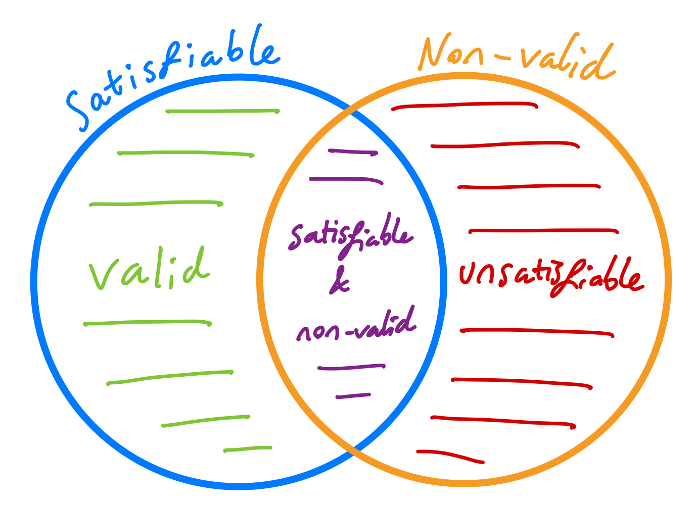
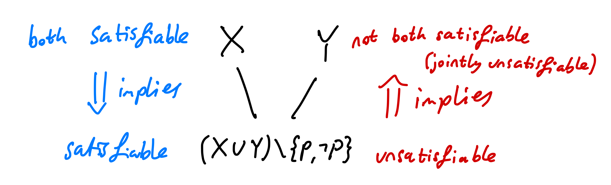

<head>
  <title>{{ page.title }}</title>
</head>
[← Models](/models)

# Propositional Logic Summary
**Author**: *Billy Price*

Propositions formulas are expressions built just from the following alphabet of symbols, $$A,B,C,...,Z, \textbf{t},\textbf{f}, \neg, \wedge, \vee, \Rightarrow, \Leftrightarrow, \oplus, (, )$$ such that any propositional letter ($$A,B,C,\dots$$ etc), $$\textbf{f}$$, and $$\textbf{t}$$, are all propositional formulas, and if $$P$$ and $$Q$$ are propositional formulas, then the following are all propositional formulas, $$ (\neg P), (P \wedge Q), (P \vee Q), (P \Rightarrow Q), (P \Leftrightarrow Q), (P \oplus Q) $$ where brackets can be dropped wherever unambiguous.

By assigning boolean values ($$0$$ or $$1$$) to each propositional letter, we can "compile" any formula to boolean value. We illustrate this by considering all possible assignments of propositional letters to boolean values, and extending this to large formulas using the following rules.

| $$A$$ | $$B$$ | $$\mathbf{f}$$ | $$\mathbf{t}$$ | $$\neg A$$ | $$A \wedge B$$  | $$A \vee B$$ | $$A \Rightarrow B$$ | $$A \Leftrightarrow B$$ | $$A \oplus B$$ |
|:-:|:-:|:-:|:-:|:-:|:-:|:-:|:-:|:-:|:-:|
| 0 | 0 | 0 | 1 | 1 | 0 | 0 | 1 | 1 | 0 |
| 0 | 1 | 0 | 1 | 1 | 0 | 1 | 1 | 0 | 1 |
| 1 | 0 | 0 | 1 | 0 | 0 | 1 | 0 | 0 | 1 |
| 1 | 1 | 0 | 1 | 0 | 1 | 1 | 1 | 1 | 0 |

We call each row of a truth table a *model* - it models a possible world in which each propositional letter is either true, $$1$$, or false, $$0$$.

## Equivalence
While $$A \wedge B$$ and $$B \wedge A$$ are *syntactically* (as expressions) different, they are *semantically* (in meaning) the same. We call this equivalence, and use a three-line equal sign to denote this, i.e., $$A \wedge B \equiv B \wedge A$$. How do we know when two formulas $$\varphi$$ and $$\psi$$ are equivalent? We define equivalence to mean the following.
Write out the truth tables for $$\varphi$$ and $$\psi$$, and look at the columns of both main connectives. If they are the same in every row (model), then $$\varphi \equiv \psi$$, otherwise $$\varphi \not\equiv \psi$$. For example, the following truth table demonstrates that $$A \wedge B \equiv B \wedge A$$

| $$A$$ | $$B$$ | $$A \wedge B$$  | $$B \wedge A$$ |
|:-:|:-:|:-:|:-:|
| 0 | 0 | 0 | 0 |
| 0 | 1 | 0 | 0 |
| 1 | 0 | 0 | 0 |
| 1 | 1 | 1 | 1 |

To show $$\varphi \not\equiv \psi$$, just show one row of the truth table which has different values for $$\varphi$$ and $$\psi$$ - don't do anything else if you can do this! Can you state a single model which demonstrates $$A \Rightarrow B \not\equiv B \Rightarrow A$$?

## Logical Consequence
Logical consequence is a weaker notion than logical equivalence. We say $$\varphi \vDash \psi$$, or "$$\psi$$ is a logical consequence of $$\varphi$$", when every model (row) in which $$\varphi$$ is $$1$$, $$\psi$$ is also $$1$$. Notice that we don't care about models where $$\varphi$$ is $$0$$, but if $$\psi$$ is $$0$$ at any model, $$\varphi$$ must also be $$0$$ there to ensure $$\varphi \vDash \psi$$ (why couldn't it by $$1$$ at $$\varphi$$?). Note that having both $$\varphi \vDash \psi$$ and $$\psi \vDash \varphi$$ tells you that $$\varphi \equiv \psi$$ (think about why). Here is a demonstration of $$A \vDash A \vee B$$, in which the last 2 models are the only ones we need to check to ensure logical consequence (these are where the first formula $$A$$ is true).

| $$A$$ | $$B$$ | $$A$$  | $$A \vee B$$ |
|:-:|:-:|:-:|:-:|
| 0 | 0 | 0 | 0 |
| 0 | 1 | 0 | 1 |
| **1** | **0** | **1** | **1** |
| **1** | **1** | **1** | **1** |

To show $$\varphi \nvDash \psi$$, just show one row of the truth table which assigns $$1$$ to $$\varphi$$ and $$0$$ to $$\psi$$ - don't do anything else if you can do this!

## Validity and Satisfiability
We introduced 4 statements about formulas, which speak about the models of a formula. Looking at its truth table, we say a formula is
* **satisfiable** - if there is **at least one model** that makes it true
* **valid/a tautology** - if **every model** makes it true
* **non-valid** - if there is **at least one model** that makes it false
* **unsatisfiable/a contradiction** - if **every model** makes it false

Importantly - these options aren't mutually exclusive, for example, every *valid* formula is *satisfiable*, every *unsatisfiable* formula is *non-valid*, and every formula which is neither *valid*, nor *unsatisfiable*, is both *satisfiable* and *valid*! Here's an illustration of these relationships.

Despite the region sizes, the vast majority of formulas are in the purple section - both *satisfiable* and *non-valid*.

## Negated claims

Observe the way these claims change when we assert they are *not* true about a formula

| $$\varphi$$ is not *satisfiable* | ...means the thing same as... | $$\varphi$$ is *unsatisfiable* |
| $$\varphi$$ is not *valid* | ...means the thing same as... | $$\varphi$$ is *non-valid* |
| $$\varphi$$ is not *non-valid* | ...means the thing same as... | $$\varphi$$ is *valid* |
| $$\varphi$$ is not *unsatisfiable* | ...means the thing same as... | $$\varphi$$ is *satisfiable* |

In contrast, a common mistake is to confuse the statement "$$\neg \varphi$$ is \_\_\_\_" with "$$\varphi$$ is not \_\_\_\_", where the blanks are replaced with one of the 4 claims about formulas. Without knowing the formula $$\varphi$$, these statements are not the same. For example $$\neg \varphi$$ is *satisfiable* does **not** tell you $$\varphi$$ is *unsatisfiable* (although it is true if $$\varphi$$ is also *valid* - not just *satisfiable*). It just tells you $$\varphi$$ is non-valid, since all we know is there is one model making $$\neg \varphi$$ true. Try to fill out the rest of this table, specifically picturing the truth tables involved, and exactly what evidence each claim gives you (it will look different to the first table).

| $$\neg \varphi$$ is *satisfiable* | ...means the thing same as... | $$\varphi$$ is *non-valid* |
| $$\neg \varphi$$ is *valid* | ...means the thing same as... | $$\varphi$$ is \_\_\_\_\_\_\_\_\_\_\_\_ |
| $$\neg \varphi$$ is *non-valid* | ...means the thing same as... | $$\varphi$$ is \_\_\_\_\_\_\_\_\_\_\_\_ |
| $$\neg \varphi$$ is *unsatisfiable* | ...means the thing same as... | $$\varphi$$ is \_\_\_\_\_\_\_\_\_\_\_\_ |

## Examples

* $$A \Rightarrow A$$ - satisfiable $$\checkmark$$, valid $$\checkmark$$, non-valid $$\times$$, unsatisfiable $$\times$$
* $$A \vee B$$ - satisfiable $$\checkmark$$, valid $$\times$$, non-valid $$\checkmark$$, unsatisfiable $$\times$$
* $$A \wedge \neg A$$ - satisfiable $$\times$$, valid $$\times$$, non-valid $$\checkmark$$, unsatisfiable $$\checkmark$$

| $$A$$ | $$B$$ | $$A \Rightarrow A$$  | $$A \vee B$$ | $$A \wedge \neg A$$ |
|:-:|:-:|:-:|:-:|:-:|
| 0 | 0 | 1 | 0 | 0 |
| 0 | 1 | 1 | 1 | 0 |
| 1 | 0 | 1 | 1 | 0 |
| 1 | 1 | 1 | 1 | 0 |

In particular, the last row, $$A \mapsto 1$$ and $$B \mapsto 1$$, is sufficent evidence to show $$A \Rightarrow A$$ is satisfiable and that $$A \vee B$$ is satisfiable. Similarly, the first row, $$A \mapsto 0$$ and $$B \mapsto 0$$ is sufficent evidence to show $$A \vee B$$ is non-valid, and that $$A \wedge \neg A$$ is non-valid. When proving satisfiability or non-validity, you do not need to present the whole truth table, and it is always best to *explicitly* identify the model which makes the formula true/false.

On the other hand, validity/tautology and unsatisfiability/contradiction claims require the whole truth table$$\dots$$ or resolution!

## Resolution

### CNF and RCNF
First we convert to CNF (conjunctive normal form), i.e., a formula of the form , where each blank is a literal (a propositional letter or its negation).
  1. Eliminate all occurrences of $$\oplus$$, using $$A \oplus B \equiv (A \vee B) \wedge (\neg A \vee \neg B)$$.
  2. Eliminate all occurrences of $$\Leftrightarrow$$, using $$A \Leftrightarrow B \equiv (A \Rightarrow B) \wedge (B \Rightarrow A)$$.
  3. Eliminate all occurrences of $$\Rightarrow$$ using $$A \Rightarrow B \equiv \neg A \vee B$$.
  4. Use De Morgan’s Laws to push $$\neg$$ inward over $$\wedge$$ and $$\vee$$, that is, $$\neg (A \wedge B) \equiv \neg A \vee \neg B$$ and $$\neg (A \vee B) \equiv \neg A \wedge \neg B$$ 
  5. Eliminate double negations using $$\neg\neg A \equiv A$$.
  6. Use the distributive laws to get the required form; you should need only $$A \vee (B \wedge C) \equiv (A \vee B) \wedge (A \vee C)$$. You will likely need to apply this repeatedly, and any of $$A,B,C$$ could be a larger complex formula.

To convert to RCNF (reduced CNF), delete any repetitions of literals, for example $$(A \vee B \vee A) \equiv (A \vee B)$$, and drop any clause which contains a formula and its negation, like $$(A \vee B \vee \neg A)$$ (these are always true, so can be ignored).

Finally we can convert RCNF to Clausal Form - a set of clauses, where each clause is a set of literals.

$$(P \vee \neg Q \vee S) \wedge (P \vee \neg R \vee S) \wedge (\neg S \vee \neg P) \wedge (\neg S \vee Q \vee R)$$
$$ \{\{P, \neg Q, S\}, \{P, \neg R, S\}, \{\neg S, \neg P\}, \{\neg S, Q, R\}\}$$

### Resolving Clauses
If we can find a propositional letter $$A$$ and two clauses, $$X, Y$$ with $$P \in X$$ and $$\neg P \in Y$$ (like $$\{P,A,B\}$$ and $$\{\neg P, C, D, E\}$$) we can conclude the clause $$(X \cup Y) \setminus \{P,\neg P\}$$, that is, all the literals in either X or Y that aren't $$P$$ or $$\neg P$$, as a **logical consequence**. For example, the clauses $$\{P,A,B\}$$ and $$\{\neg P, C, D, E\}$$ *resolve* to $$\{A,B,C,D,E\}$$. Paying attention to the precise definition of logical consequence, pick two small clauses that can be resolved, and convince yourself that the resolvent is a logical consequence of those two clauses together. Importantly, the resolvent is *not* equivalent to the previous two, it's just a logical consequence.

In the above image, we make use of the principle written in red, which says that if we can ever derive a contradiction (an unsatisfiable clause), we can conclude the unsatisfiability of the original clauses. We consider the empty clause, written $$\emptyset$$, unsatisfiable, because the only way to derive it is to *resolve* a pair of clauses of the form $$\{P\}$$ and $$\{\neg P\}$$, which together represent $$P \wedge \neg P$$ (clearly unsatisfiable).

### A common misconception

What do the clauses $$\{A,B\}$$ and $$\{\neg A, \neg B\}$$ resolve to? Is it $$\emptyset$$? No! That would mean that $$(A \vee B) \wedge (\neg A \vee \neg B)$$ is unsatisfiable, but it isn't! Consider the model where $$A$$ is true and $$B$$ is false - this makes the formula true.

These clauses actually resolve to either $$\{B,\neg B\}$$ or to $$\{A,\neg A\}$$, since we can only resolve on one letter at a time. Both true of these formulas are always in any model - so are equivalent to $$\textbf{t}$$ (true). But having "true" as a logical consequence tells you nothing! All formulas have "true" as a logical consequence. Given only these clauses, we are at a dead end - there is no contradiction among them.

## Usage of Resolution

**ONLY USE RESOLUTION ON A FORMULA TO SHOW IT IS UNSATISFIABLE**.

Resolution doesn't tell you "whether or not" your formula is unsatisfiable - in its basic form, it can only confirm that a formula is unsatisfiable. It is true that a set of clauses representing a satisfiable (i.e. not unsatisfiable) formula cannot derive the empty set via resolution, but to show satisfiability of the formula in this way, you'd need to demonstrate that your algorithm for choosing clauses to resolve will *always* derive the empty set if its possible, and that your algorithm fails to do so for the formula in question. There are better ways!

I want to show my formula is...
* **unsatisfiable/a contradiction** - convert to RCNF and resolve to $$\emptyset$$
* **valid/a tautology** - negate the formula, then convert to RCNF and resolve to $$\emptyset$$
* **satisfiable** - find a model which makes the formula true
* **non-valid** - find a model which makes the formula false

The first two of these demonstrate a fact about *every* model in a formula's truth table via resolution, and the second two skip resolution and just demonstrate that *at least one* model makes the formula true/false - much easier! Note that the first two are sometimes quicker demonstrated by writing down the truth table - resolution comes in handy when the truth table grows too large.

### Showing equivalence and logical consequence
Given formulas $$\varphi$$ and $$\psi$$, to show...
* $$\varphi \vDash \psi$$ - construct $$\varphi \wedge \neg \psi$$, convert it to RCNF, then resolve to $$\emptyset$$. Note, this is just showing that $$\varphi \Rightarrow \psi$$ is valid, since $$\neg(\varphi \Rightarrow \psi) \equiv \varphi \wedge \neg \psi$$.
* $$\varphi \equiv \psi$$ - construct $$\varphi \oplus \psi$$, convert to RCNF, then resolve to $$\emptyset$$.

More generally, we can demonstrate that a conclusion $$\psi$$ follows from the assumption of premises $$\varphi_1, \varphi_2, \dots \varphi_n$$, we consider the formula $$\varphi_1 \wedge \varphi_2 \wedge \dots \varphi_n \wedge \neg \psi$$, convert it to RCNF, and resolve to $$\emptyset$$. Again, this is just demonstrating that $$(\varphi_1 \wedge \varphi_2 \wedge \dots \wedge \varphi_n) \Rightarrow \psi$$ is valid (a tautology). Note that each premise, $$\varphi_i$$, can be separately converted to clausal form and combined with the rest, since they are all part of a larger conjunction (remember to negate the conclusion, $$\psi$$, before converting to RCNF).